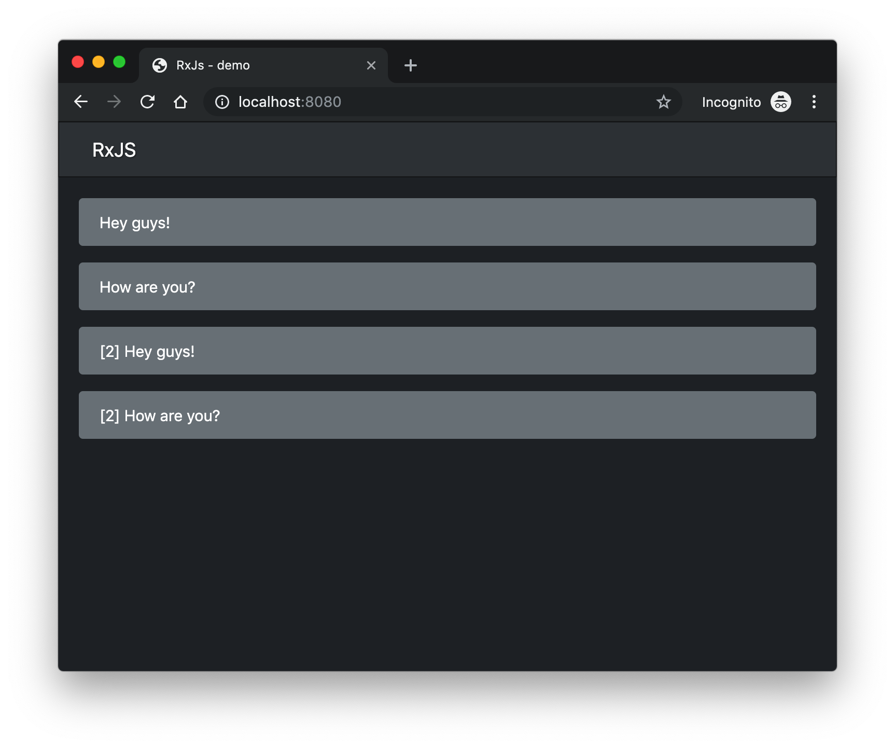

# rxjs-tutorial
Learn reactive programming with RxJS. 

## Table of contents
* [General info](#general-info)
* [Technologies](#technologies)
* [Features](#features)
* [Screenshots](#screenshots)
* [Setup](#setup)
* [Status](#status)
* [License](#license)

## General info
Goal of project is to learn how to use RxJS. [ReactiveX](http://reactivex.io) is a combination of the best ideas from the Observer pattern, the Iterator pattern, and functional programming. 

## Technologies
* [ReactiveX] (http://reactivex.io)
* [RxJS](https://github.com/ReactiveX/rxjs)
* [TypeScript](https://www.typescriptlang.org)
* [Bootstrap](https://getbootstrap.com)
* [Webpack](https://webpack.js.org)
* [Prettier](https://prettier.io)

## Features
* Observables & Subscriptions
* Operators
* Subject

## Screenshots

## Setup
How to run this project.

1. Clone this repo

2. Go to project folder and install dependencies
`$ yarn --ignore-engines`

3. Now start dev server by running
`$ yarn start`

4. Visit - http://localhost:8080/

## Status
Project is finished.

## License
MIT
